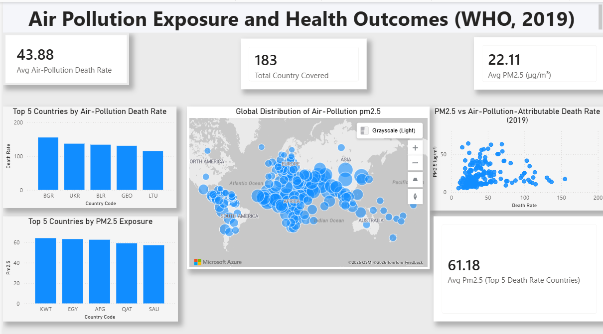

# 🌫️ Air Pollution and Health Outcomes (WHO, 2019)

## Project Overview

This project analyzes the relationship between **air pollution exposure** and **health outcomes** across countries using open healthcare data from the **World Health Organization (WHO)**.

The analysis focuses on **PM2.5 air pollution levels** and **air-pollution-attributable death rates** at the **country level** for the year **2019**.

---

## Data Sources

The data was accessed programmatically via the **WHO Global Health Observatory (GHO) API**.

### Indicators Used

* **PM2.5 Exposure (`SDGPM25`)**
  Average national concentration of fine particulate matter (PM2.5), measured in µg/m³.

* **Air-Pollution-Attributable Death Rate (`AIR_5`)**
  Mortality rate attributable to air pollution, reported at the country level.

---

## Dataset Description

The final dataset represents a **cross-sectional snapshot for 2019** and contains **183 countries**.
For furhter analysis corresponding continent is also added.

Each row corresponds to **one country in one year** with the following variables:

| Column         | Description                              |
| -------------- | ---------------------------------------- |
| `country_code` | ISO country code                         |
| `year`         | Reference year (2019)                    |
| `pm25`         | Average PM2.5 exposure (µg/m³)           |
| `death_rate`   | Death rate attributable to air pollution |
| `continent`    | Continent                                |

---

## Data Preparation Summary

* PM2.5 data was filtered to include **national total exposure values** only.
* Death-rate data was filtered to:

  * Country-level observations
  * Both sexes combined
  * Total air-pollution causes
* The two datasets were merged using **country code** and **year**, retaining only countries with data available for both indicators.

---

## Scope and Limitations

* The analysis is **cross-sectional**, limited to the year **2019**, due to the availability of country-level mortality data.
* The dataset supports **between-country comparisons** and **between-continent comparisons**.
* Results describe **associations**, not causal relationships.

---

## Intended Use

This dataset is suitable for:

* Exploratory data analysis (EDA)
* Cross-country comparison of environmental health risks
* Visualization and policy-oriented insights
* Portfolio demonstration of real-world data ingestion and preparation

---

## One-Sentence Summary

> This project provides a country-level snapshot of PM2.5 air pollution exposure and its associated mortality impact across 183 countries in 2019.

---

## Repository Structure

```
who-air-pollution-analysis/
├── assets/
├── data/
│   ├── raw/
│   └── processed/
├── notebooks/
├── README.md
```

---
## Dashboard


## 🔑 Key Insights & Implications

### Key Insights
- 🌫️ **PM2.5 exposure varies substantially across countries**, with the highest levels concentrated in parts of the Middle East and South Asia.
- ☣️ **Air-pollution-attributable mortality does not increase proportionally with PM2.5 levels**; the observed relationship is weakly positive, indicating a complex and non-linear association.
- 🌍 **Countries with the highest air-pollution death rates exhibit only moderate average PM2.5 exposure** (≈15 µg/m³), which is *lower than the global average* (≈22 µg/m³). This suggests that high mortality can occur even without extreme pollution levels.
- 🔎 **In contrast, countries with the highest PM2.5 exposure show average mortality rates close to the global mean**, highlighting that high pollution alone does not necessarily translate into the highest health burden.
- 🧩 **These contrasting country-level patterns indicate that population vulnerability—such as age structure, baseline health, and healthcare system capacity—plays a critical role in shaping pollution-related health outcomes.**

#### Continental Perspective
- 🌏 **Asia exhibits the highest average PM2.5 exposure**, accompanied by elevated mortality, reinforcing its central role in the global pollution burden.
- 🇪🇺 **Europe records the highest average air-pollution-attributable mortality despite relatively low PM2.5 exposure**, underscoring the influence of demographic structure and underlying health conditions.
- 🌍 **Africa combines high PM2.5 exposure with comparatively moderate mortality**, suggesting the role of younger population structures, under-diagnosis, or variation in healthcare access.
- 🌎 **North America and Oceania show both low PM2.5 exposure and low mortality**, reflecting stronger environmental regulation and healthcare systems.
- 🌎 **South America falls between these extremes**, indicating mixed environmental and health system conditions.

### Implications
- 🏛️ **Air quality policies should be complemented by health system strengthening**, especially in regions experiencing high mortality despite moderate pollution exposure.
- 📊 **Cross-country and regional assessments of air pollution impacts must incorporate demographic and healthcare context**, rather than relying solely on pollution intensity metrics.
- 📈 **Reducing PM2.5 exposure remains important, but targeted public health interventions may yield substantial benefits even where pollution levels are not extreme.**
- ⚠️ **As this analysis is cross-sectional (2019), findings describe associations rather than causation**, underscoring the need for longitudinal studies to evaluate long-term exposure effects.

### One-line takeaway
> **Air pollution matters, but population vulnerability and health system capacity are decisive factors in determining its ultimate health impact across both countries and regions.**


---